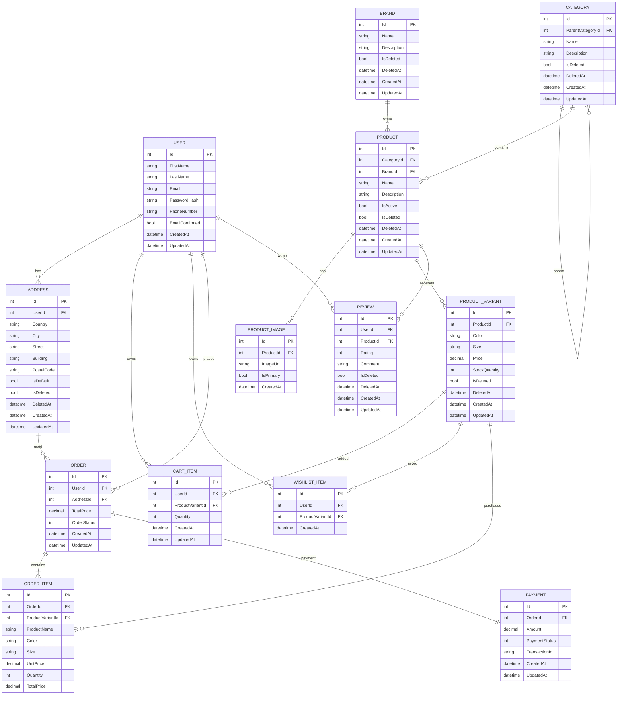

```mermaid
erDiagram

    USER {
        int Id PK
        string FirstName
        string LastName
        string Email
        string PasswordHash
        string PhoneNumber
        bool EmailConfirmed

        datetime CreatedAt
        datetime UpdatedAt
    }

    ADDRESS {
        int Id PK
        int UserId FK

        string Country
        string City
        string Street
        string Building
        string PostalCode
        bool IsDefault

        bool IsDeleted
        datetime DeletedAt
        datetime CreatedAt
        datetime UpdatedAt
    }

    CATEGORY {
        int Id PK
        int ParentCategoryId FK

        string Name
        string Description

        bool IsDeleted
        datetime DeletedAt
        datetime CreatedAt
        datetime UpdatedAt
    }

    BRAND {
        int Id PK

        string Name
        string Description

        bool IsDeleted
        datetime DeletedAt
        datetime CreatedAt
        datetime UpdatedAt
    }

    PRODUCT {
        int Id PK
        int CategoryId FK
        int BrandId FK

        string Name
        string Description
        bool IsActive

        bool IsDeleted
        datetime DeletedAt
        datetime CreatedAt
        datetime UpdatedAt
    }

    PRODUCT_IMAGE {
        int Id PK
        int ProductId FK

        string ImageUrl
        bool IsPrimary

        datetime CreatedAt
    }

    PRODUCT_VARIANT {
        int Id PK
        int ProductId FK

        string Color
        string Size

        decimal Price
        int StockQuantity

        bool IsDeleted
        datetime DeletedAt
        datetime CreatedAt
        datetime UpdatedAt
    }

    CART_ITEM {
        int Id PK
        int UserId FK
        int ProductVariantId FK

        int Quantity

        datetime CreatedAt
        datetime UpdatedAt
    }

    WISHLIST_ITEM {
        int Id PK
        int UserId FK
        int ProductVariantId FK

        datetime CreatedAt
    }

    ORDER {
        int Id PK
        int UserId FK
        int AddressId FK

        decimal TotalPrice
        int OrderStatus

        datetime CreatedAt
        datetime UpdatedAt
    }

    ORDER_ITEM {
        int Id PK
        int OrderId FK
        int ProductVariantId FK

        string ProductName
        string Color
        string Size

        decimal UnitPrice
        int Quantity
        decimal TotalPrice
    }

    PAYMENT {
        int Id PK
        int OrderId FK

        decimal Amount

        int PaymentStatus

        string TransactionId

        datetime CreatedAt
        datetime UpdatedAt
    }

    REVIEW {
        int Id PK
        int UserId FK
        int ProductId FK

        int Rating
        string Comment

        bool IsDeleted
        datetime DeletedAt
        datetime CreatedAt
        datetime UpdatedAt
    }

    USER ||--o{ ADDRESS : has

    USER ||--o{ CART_ITEM : owns

    USER ||--o{ WISHLIST_ITEM : owns

    USER ||--o{ ORDER : places

    USER ||--o{ REVIEW : writes

    CATEGORY ||--o{ CATEGORY : parent

    CATEGORY ||--o{ PRODUCT : contains

    BRAND ||--o{ PRODUCT : owns

    PRODUCT ||--o{ PRODUCT_IMAGE : has

    PRODUCT ||--o{ PRODUCT_VARIANT : has

    PRODUCT ||--o{ REVIEW : receives

    PRODUCT_VARIANT ||--o{ CART_ITEM : added

    PRODUCT_VARIANT ||--o{ WISHLIST_ITEM : saved

    PRODUCT_VARIANT ||--o{ ORDER_ITEM : purchased

    ADDRESS ||--o{ ORDER : used

    ORDER ||--|{ ORDER_ITEM : contains

    ORDER ||--|| PAYMENT : payment
```
